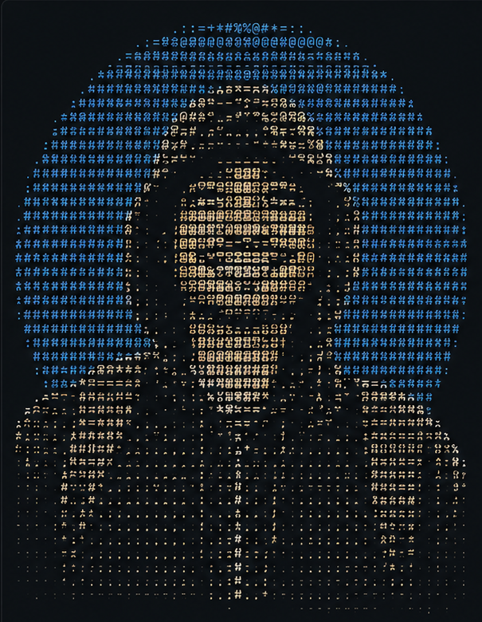

<table>
<tr>
<td width="42%" valign="top">



```
// Code. Capture. Create.
// Building solutions, capturing moments,
// and creating impact.
```

</td>
<td width="58%" valign="top">

## `hridayadhikari@github`
---

- 🖥️ **OS**: Windows 11 Home 64-bit
- ⏱️ **Uptime**: 20+ years of curiosity
- 👤 **Role**: Developer | Designer | Photographer
- 🎓 **Education**: B.Tech CSE (2026) — Techno College of Engineering Agartala
- 📍 **Location**: Agartala, Tripura, India

---

- 💻 **Languages**: Java, JavaScript, PHP, Python, SQL, HTML, CSS
- 📦 **Frameworks**: Laravel, Express.js, FastAPI, React
- 🗄️ **Database**: MySQL
- 🔧 **Tools**: Git, GitHub, VS Code, Postman, Docker, Figma, Canva, Photoshop

---

- ⭐ **Interests**: Backend Development, System Design, AI Applications, Photography, Community Building
- 🚀 **Currently**: Learning Backend Engineering · Building Scalable Systems · Preparing for Placements & ATO Exam

</td>
</tr>
</table>

### 👥 Connect with me
---

| | |
|---|---|
| ✉️ **Email (Personal)** | hridayadhikari.it@gmail.com |
| ✉️ **Email (Work)** | hriday.work@protonmail.com |
| 💼 **LinkedIn** | [linkedin.com/in/hridayadhikari](https://linkedin.com/in/hridayadhikari) |
| 🐙 **GitHub** | [github.com/hridayadhikari](https://github.com/hridayadhikari) |
| 📷 **Instagram** | [instagram.com/hridayadhikari](https://instagram.com/hridayadhikari) |

### 📊 GitHub Stats
---

| Repos | Contributed | Stars | Followers |
|---|---|---|---|
| 32 | 12 | 78 | 96 |

| Commits | PRs | Issues | Gists |
|---|---|---|---|
| 1,248 | 18 | 14 | 06 |

**Lines of Code:** 156,842 &nbsp;&nbsp;|&nbsp;&nbsp; **Total Contributions:** 3,214+